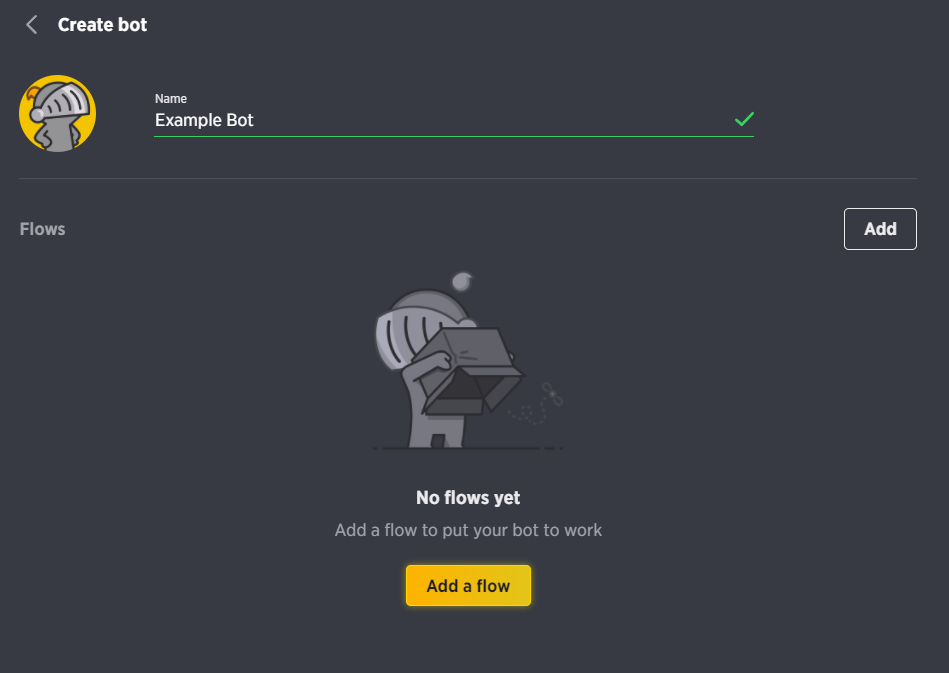

# Setting up a Guilded bot

## Install our library

Make a directory for your new bot and run the install command to start installing our library.


If you're unfamiliar with JavaScript / TypeScript or Node we highly recommend that you research more into the languages and try out some basics!




```bash
npm install guilded.js
```



```bash
yarn add guilded.js
```



## Create the bot application

To create a bot application, first you must go to your `Server settings > Bots`


Guilded currently has two ways to make a bot. There are "bot flows" and then the bot we want to make. Because of this we can ignore Guilded's bot flow when creating our bot application. Make sure too click `Save changes` in the bottom left to confirm the bots creation.




## Get your bots token

To be able to use your newly created bot you need to get its `token` this is how the bot confirms its identity with Guilded. Anything the bot does it needs this token to make every request, but don't worry we handle that hard part for you.&#x20;


**Never share your token with anyone, not even your own family. If you do, you run the risk of your bot being compromised and potentially causing harm to the communities it's in by sharing this token**


Back in our `Server settings > Bots` menu we can now click the bots three dot menu. Select `Manage auth tokens` then press `Generate token` to generate the bots auth token.

.png>)

.png>)

## Publishing your bot

Want your bot to be sharable and used in other servers? You can easily publish the bot.


**If you publish your bot you will NOT be able to unpublish it or delete it.**


You can go back to the same three dot menu where we managed our auth token and you can click publish bot. **This action cannot be reversed currently.**

.png>)
